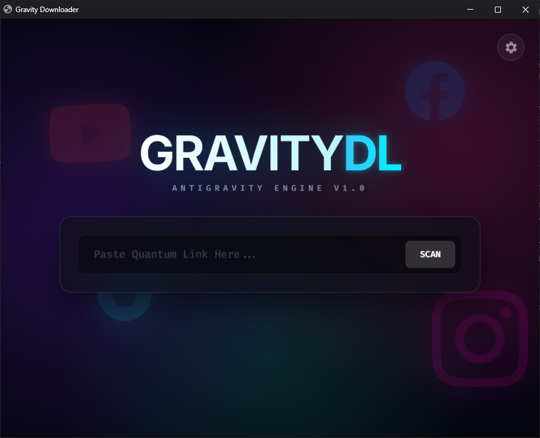
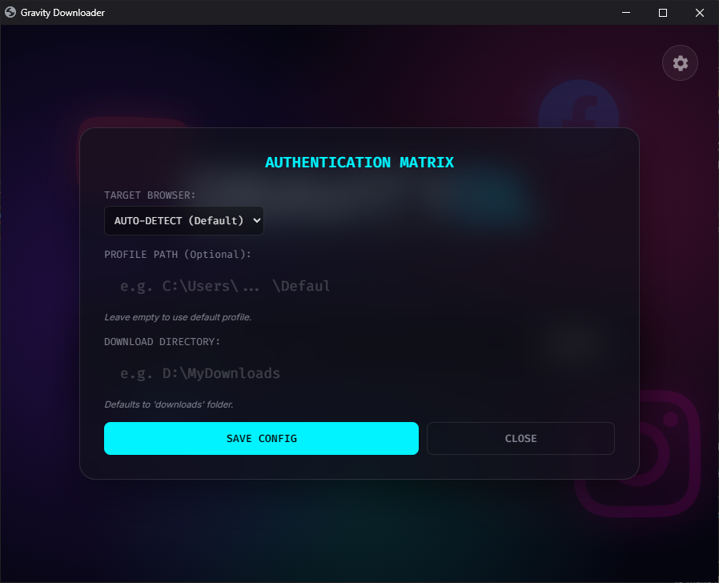

# 🚀 AntigravityDownload

A powerful, user-friendly video downloader that supports multiple platforms. Download videos from YouTube, Facebook, Instagram, Twitter, and many more with just a URL!

## ✨ Features

- 🎥 **Multi-Platform Support** - Download from YouTube, Facebook, Instagram, Twitter, TikTok, and more
- 🎨 **Modern UI** - Clean and intuitive interface built with CustomTkinter
- 📊 **Progress Tracking** - Real-time download progress with speed and ETA
- 🎬 **Format Selection** - Choose video quality and format
- 📁 **Organized Downloads** - Automatic file organization
- ⚡ **Fast Downloads** - Optimized download engine using yt-dlp
- 🔄 **Batch Downloads** - Queue multiple videos at once

## 📸 Screenshots

### Main Interface


### Settings



## 🛠️ Installation

### Prerequisites
- Python 3.8 or higher
- pip (Python package manager)

### Setup

1. **Clone the repository**
```bash
git clone https://github.com/amilaanjanab/antigravityDownload.git
cd antigravityDownload
```

2. **Install dependencies**
```bash
pip install -r requirements.txt
```

3. **Run the application**
```bash
python main.py
```

## 📦 Dependencies

- `yt-dlp` - Video download engine
- `customtkinter` - Modern UI framework
- See `requirements.txt` for full list

## 🎯 Usage

1. Launch the application
2. Paste the video URL
3. Select your preferred quality/format
4. Click Download
5. Videos will be saved to the `downloads/` folder

## 🔧 Configuration

Edit `config.json` to customize:
- Default download directory
- Preferred video quality
- Output format preferences

## 📝 Changelog

See [CHANGELOG.md](CHANGELOG.md) for version history and updates.

## 🤝 Contributing

Contributions are welcome! Feel free to:
- Report bugs
- Suggest new features
- Submit pull requests

## 📄 License

This project is open source and available under the MIT License.

## 🙏 Acknowledgments

- Built with [yt-dlp](https://github.com/yt-dlp/yt-dlp)
- UI powered by [CustomTkinter](https://github.com/TomSchimansky/CustomTkinter)

## 📧 Contact

**Amila Anjana**  
GitHub: [@amilaanjanab](https://github.com/amilaanjanab)

---

⭐ If you find this project useful, please consider giving it a star!
