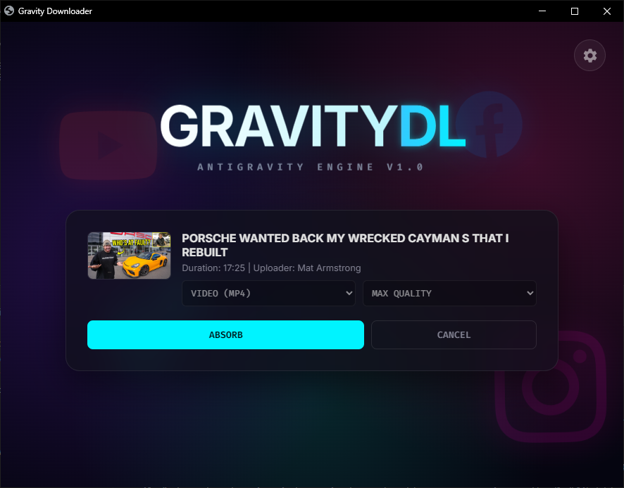
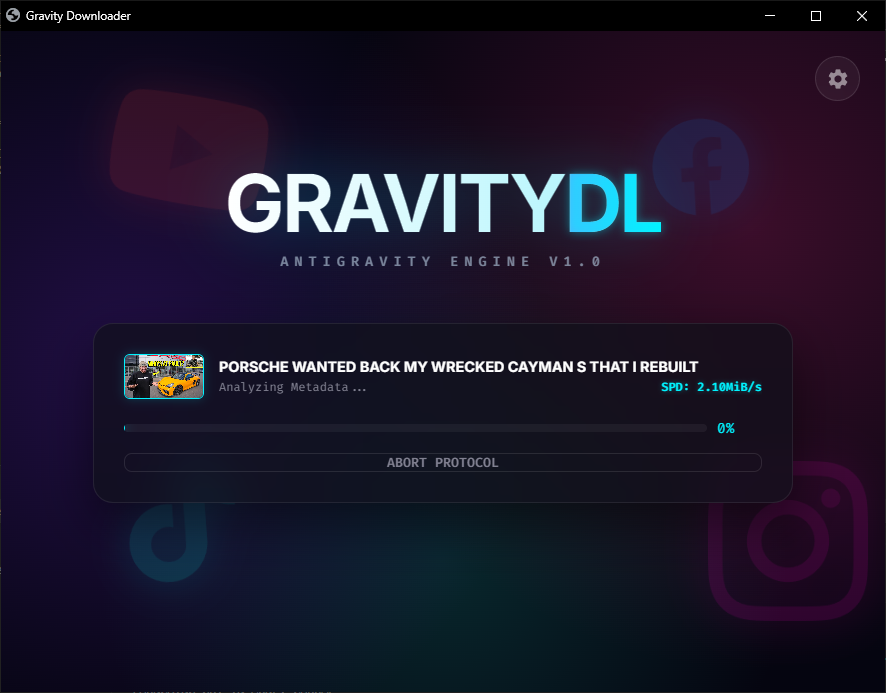

# 🚀 AntigravityDL - Free Video Downloader for YouTube, Facebook, Instagram & More

<div align="center">


**Download videos from 100+ websites with one click!**

[](https://github.com/amilaanjanab/antigravityDL/releases)
[](https://www.python.org/downloads/)
[](https://opensource.org/licenses/MIT)
[](https://github.com/amilaanjanab/antigravityDL/releases)
[](https://github.com/amilaanjanab/antigravityDL/stargazers)

[Download Now](#-installation) • [Features](#-features) • [Screenshots](#-screenshots) • [Documentation](#-usage)

</div>

---

## 📖 Table of Contents

- [Overview](#-overview)
- [Key Features](#-key-features)
- [Screenshots](#-screenshots)
- [Installation](#-installation)
- [Quick Start](#-quick-start)
- [Supported Platforms](#-supported-platforms)
- [Usage Guide](#-usage-guide)
- [FAQ](#-faq)
- [Contributing](#-contributing)
- [License](#-license)

---

## 🌟 Overview

**AntigravityDL** is a powerful, free, and open-source video downloader that supports **100+ websites** including YouTube, Facebook, Instagram, Twitter, TikTok, Vimeo, Dailymotion, and many more. Built with Python and powered by yt-dlp, it offers a modern web-based interface with real-time progress tracking, quality selection, and browser cookie authentication for private content.

### Why Choose AntigravityDL?

✅ **100% Free & Open Source** - No subscriptions, no ads, no limitations  
✅ **Multi-Platform Support** - Download from YouTube, Facebook, Instagram, TikTok, Twitter, and 100+ sites  
✅ **High-Quality Downloads** - Choose from 4K, 1080p, 720p, 480p, or audio-only  
✅ **Fast & Reliable** - Powered by yt-dlp, the most advanced video download engine  
✅ **Privacy-Focused** - Download private videos using browser cookies  
✅ **Batch Downloads** - Queue multiple videos and download playlists  
✅ **Cross-Platform** - Works on Windows, macOS, and Linux  
✅ **Modern UI** - Clean, intuitive browser-based interface  
✅ **No Installation Required** - Standalone .exe available for Windows  

---

## ✨ Key Features

### 🎥 **Video Download Capabilities**

- **Multi-Platform Support**: YouTube, Facebook, Instagram, Twitter, TikTok, Vimeo, Dailymotion, Reddit, Twitch, and 100+ more
- **Quality Selection**: Download in Best, 4K, 1080p, 720p, 480p, or extract audio only (MP3)
- **Playlist Support**: Download entire YouTube playlists and channels
- **Batch Downloads**: Queue multiple videos for sequential downloading
- **Format Options**: Save as MP4 (video) or MP3 (audio)

### 🎨 **User Interface**

- **Modern Web UI**: Clean, responsive interface that opens in your browser
- **Real-Time Progress**: Live download progress with speed, ETA, and percentage
- **Video Preview**: See thumbnail, title, duration, and uploader before downloading
- **Dark Mode Ready**: Eye-friendly interface for extended use

### 🔐 **Advanced Features**

- **Browser Cookie Authentication**: Access age-restricted and private videos
- **Multi-Browser Support**: Works with Chrome, Brave, Edge, Firefox, and Opera
- **Automatic Port Switching**: Handles port conflicts intelligently
- **Error Recovery**: Comprehensive error handling with helpful messages
- **Configurable Settings**: Customize download location and browser preferences

### ⚡ **Performance & Reliability**

- **Fast Downloads**: Optimized download engine with multi-threading
- **Resume Support**: Continue interrupted downloads
- **Metadata Extraction**: Automatically saves video descriptions
- **Smart Filename Handling**: Sanitizes filenames for compatibility

---

## 📸 Screenshots

### Main Interface

*Clean and intuitive interface - just paste your video URL and go!*

### Download Screen

*Video metadata preview with quality selection options*

### Active Download

*Real-time progress tracking with speed and status updates*

### Settings

*Configure browser authentication and download preferences*

---

## 🛠️ Installation

### Method 1: Install via pip (Easiest!)

Perfect for Python users who want the latest version:

```bash
pip install antigravitydl
```

Then run:
```bash
antigravitydl
```

**All dependencies installed automatically!** ✨

### Method 2: Download Windows Executable (No Python Required!)

Best for Windows users who don't have Python installed:

1. Go to [**Releases**](https://github.com/amilaanjanab/antigravityDL/releases/latest)
2. Download `AntigravityDL-v1.0.0-Windows.zip`
3. Extract the ZIP file
4. Double-click `AntigravityDL.exe`

**No Python, no dependencies, just download and run!** 🎉

### Method 3: From Source (For Developers)

**Prerequisites:**
- Python 3.8 or higher
- pip (Python package manager)

**Setup:**

```bash
# Clone the repository
git clone https://github.com/amilaanjanab/antigravityDL.git
cd antigravityDL

# Install dependencies
pip install -r requirements.txt

# Run the application
python main.py
```

**Windows users can also use:**
```bash
run.bat
```

---

## 🚀 Quick Start

1. **Launch the application** (using any method above)
2. **Paste a video URL** (YouTube, Facebook, Instagram, etc.)
3. **Select quality** (Best, 1080p, 720p, 480p, or Audio Only)
4. **Click Download**
5. **Find your video** in the `downloads` folder

That's it! 🎊

---

## 🌐 Supported Platforms

AntigravityDL supports **100+ websites** including:

### 📹 Video Platforms
- **YouTube** - Videos, playlists, channels, live streams
- **Vimeo** - Public and private videos
- **Dailymotion** - All video types
- **Twitch** - VODs and clips

### 📱 Social Media
- **Facebook** - Public and private videos (with authentication)
- **Instagram** - Posts, Reels, Stories, IGTV
- **Twitter/X** - Videos and GIFs
- **TikTok** - Videos without watermark
- **Reddit** - Video posts

### 🎬 Entertainment
- **Netflix** - (with proper authentication)
- **Amazon Prime Video** - (with proper authentication)
- **Disney+** - (with proper authentication)
- **Crunchyroll** - Anime videos

### 📺 And Many More!
- Soundcloud, Bandcamp, Mixcloud (audio)
- Udemy, Coursera (educational content)
- Pornhub, Xvideos (adult content)
- **100+ other platforms**

*Full list available at [yt-dlp supported sites](https://github.com/yt-dlp/yt-dlp/blob/master/supportedsites.md)*

---

## 📚 Usage Guide

### Basic Download

1. Copy the video URL from your browser
2. Paste it into AntigravityDL
3. Select your preferred quality
4. Click "Download"

### Downloading Playlists

- Paste the playlist URL
- The app will automatically detect and download all videos
- Progress shows current video (e.g., "ABSORBING [3/25]")

### Downloading Private/Age-Restricted Videos

1. Click the **Settings** icon (⚙️)
2. Select your browser (Chrome, Brave, Edge, Firefox)
3. The app will use your browser cookies for authentication
4. Now you can download private and age-restricted content

### Audio-Only Downloads

1. Paste the video URL
2. Select **"Audio Only"** from the quality dropdown
3. Download - the app will extract and save as MP3

### Changing Download Location

1. Click **Settings** (⚙️)
2. Enter your preferred download path
3. Click "Save Config"

---

## ❓ FAQ

### **Q: Is AntigravityDL free?**
**A:** Yes! 100% free and open-source. No subscriptions, no ads, no hidden costs.

### **Q: Is it legal to download videos?**
**A:** Downloading videos for personal use is generally legal, but distributing copyrighted content is not. Always respect copyright laws and terms of service.

### **Q: Why does my download fail?**
**A:** Common reasons:
- Check your internet connection
- Some sites may block downloads
- Try using browser cookie authentication for private videos
- Update to the latest version

### **Q: Can I download 4K videos?**
**A:** Yes! Select "Best" quality to download the highest available resolution.

### **Q: Does it work on Mac/Linux?**
**A:** Yes! Use the pip installation method or run from source. The .exe is Windows-only.

### **Q: How do I update?**
**A:** 
- **pip users**: `pip install --upgrade antigravitydl`
- **.exe users**: Download the latest release
- **Source users**: `git pull`

### **Q: Is my data safe?**
**A:** Yes! AntigravityDL runs locally on your computer. No data is sent to external servers except for downloading videos.

---

## 🤝 Contributing

Contributions are welcome! Here's how you can help:

1. **Report Bugs**: [Open an issue](https://github.com/amilaanjanab/antigravityDL/issues)
2. **Suggest Features**: Share your ideas in issues
3. **Submit Pull Requests**: Fix bugs or add features
4. **Star the Project**: Show your support ⭐
5. **Share**: Tell others about AntigravityDL

### Development Setup

```bash
git clone https://github.com/amilaanjanab/antigravityDL.git
cd antigravityDL
pip install -r requirements.txt
python main.py
```

---

## 📄 License

This project is licensed under the **MIT License** - see the [LICENSE](LICENSE) file for details.

### Third-Party Licenses

- **yt-dlp**: [Unlicense](https://github.com/yt-dlp/yt-dlp/blob/master/LICENSE)
- **Eel**: [MIT License](https://github.com/python-eel/Eel/blob/master/LICENSE)
- **browser-cookie3**: [MIT License](https://github.com/borisbabic/browser_cookie3/blob/master/LICENSE)

---

## 🙏 Acknowledgments

- **[yt-dlp](https://github.com/yt-dlp/yt-dlp)** - The powerful video download engine
- **[Eel](https://github.com/python-eel/Eel)** - Python + Web GUI framework
- **[browser-cookie3](https://github.com/borisbabic/browser_cookie3)** - Browser cookie extraction

---

## 📞 Support

- **Issues**: [GitHub Issues](https://github.com/amilaanjanab/antigravityDL/issues)
- **Discussions**: [GitHub Discussions](https://github.com/amilaanjanab/antigravityDL/discussions)
- **Email**: your.email@example.com

---

## 🌟 Star History

[](https://star-history.com/#amilaanjanab/antigravityDL&Date)

---

## 📊 Project Stats


---

<div align="center">

**Made with ❤️ by [Amila Anjana](https://github.com/amilaanjanab)**

If you find this project useful, please consider giving it a ⭐!

[⬆ Back to Top](#-antigravitydl---free-video-downloader-for-youtube-facebook-instagram--more)

</div>
